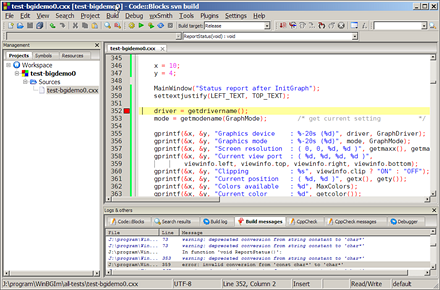

# 3D_graphic_militaryBase

# Starting

- Install CodeBlocks

- Clone this repo
```bash
$ git clone https://github.com/axelvag/3D_graphic_militaryBase 3D_graphic_militaryBase
```

- Enter in 3D_graphic_militaryBase/gkit2light/build
  
- Open with Code Blocks the WORKSPACE file gKit2light

- Run with the green arrow in the top of the nav bar (below "Debug")


  


## More Info

OPEN README.pdf for more information and to see the detail 3D result of this project !


