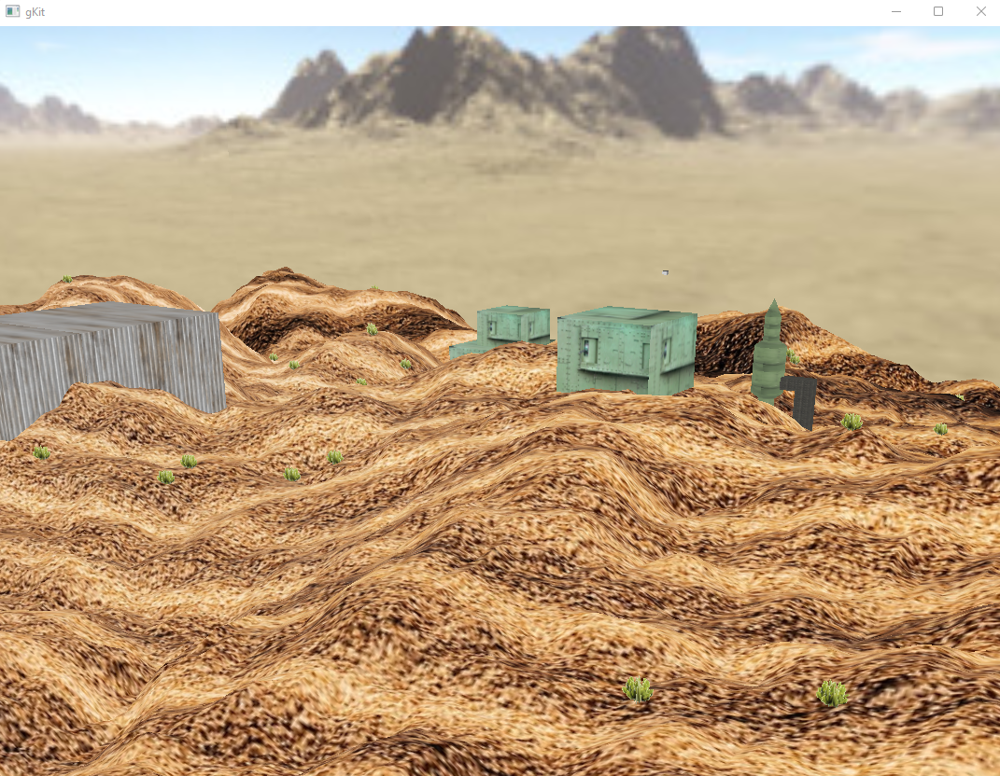
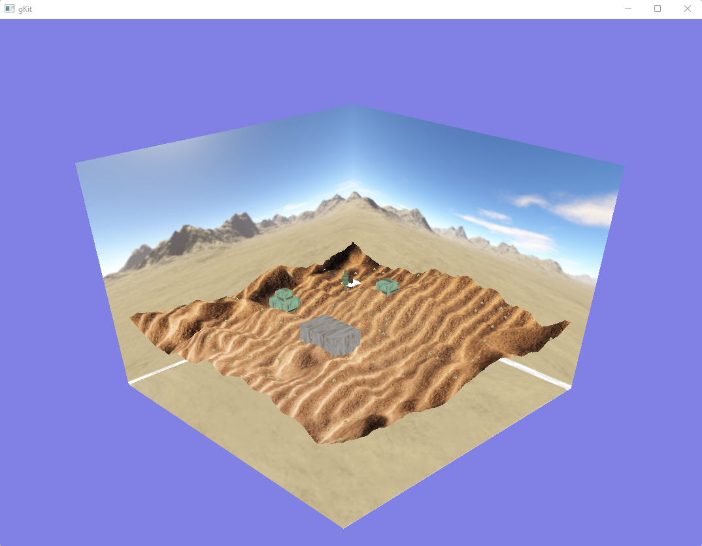
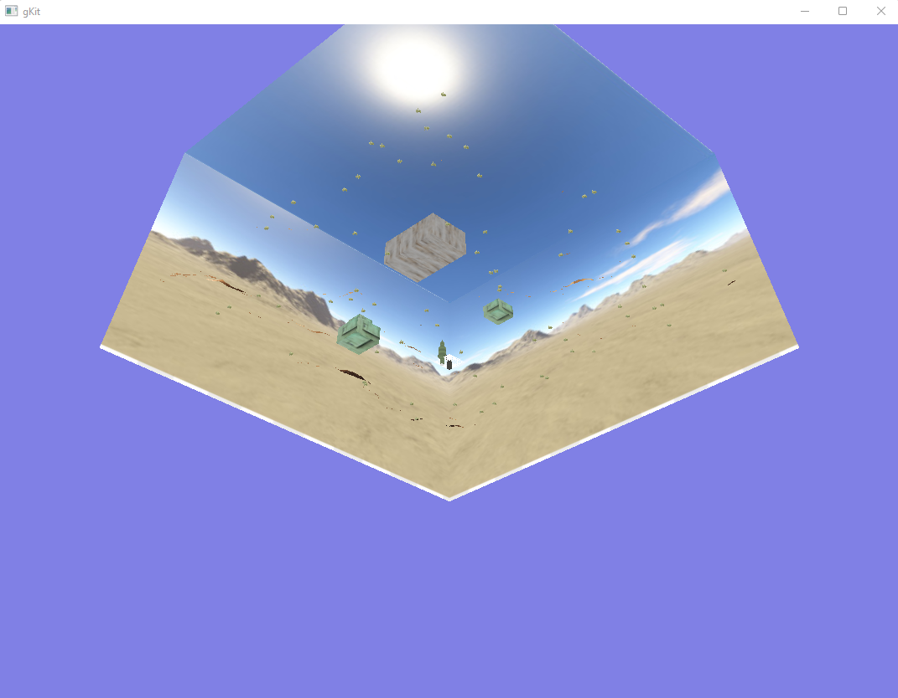
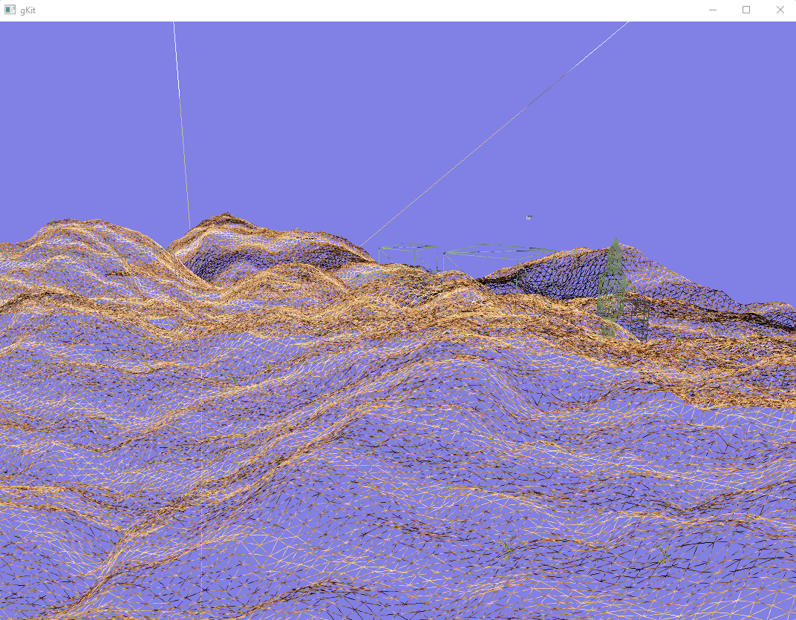
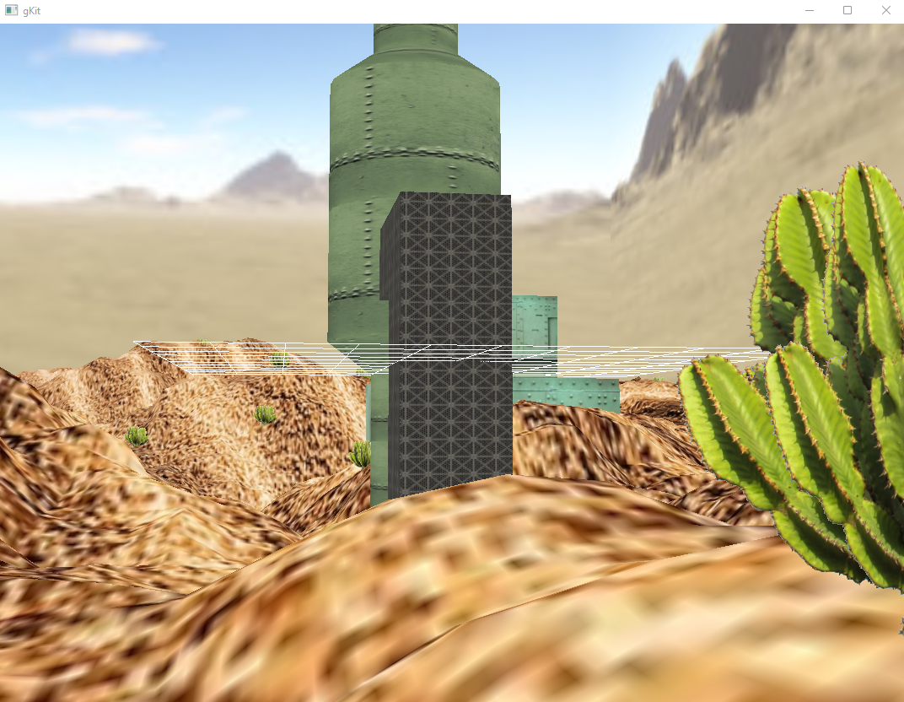

# 3D_graphic_militaryBase





# Play

- move:
  - Move the camera: arrow up or down
  - Rotate: mouse + left button
  - Zoom: mouse vertical movement + right button
  - Move the Sun: Ctrl + arrow up or down

- move more information:
  - rotates around the center by left clicking and moving the mouse
  - move forward and backward clicking the right button and moving the mouse forward or backward (or the up or down arrows on the keyboard)
  - move right or left with the keyboard arrows
  - move the light source with Ctrl + the up or down arrows on the keyboard
 
- mode:
    - enter 'h' in the terminal for "helpe
    - 'c': (des)activate GL_CULL_FACE
    - 'w': (des)activate wireframe

    - 'a': (des)activate axis display
    - 'g': (des)activate grid display

    - 'z': (des)activate displaying the animation curve

# Subject

[**Download the Subject PDF**](Subject.pdf)

# Starting

- Install CodeBlocks (information at the bottom of this page)

- Clone this repo
```bash
$ git clone https://github.com/axelvag/3D_graphic_militaryBase 3D_graphic_militaryBase
```

- Enter in 3D_graphic_militaryBase/gkit2light/build
  
- Open with Code Blocks the WORKSPACE file gKit2light

- Run with the green arrow in the top of the nav bar (below "Debug")

# GrAPiC 

## Starting

Linux, Windows and Mac instruction :

http://licence-info.univ-lyon1.fr/grapic

## Introduction

GrAPiC is a small, easy-to-use framework to add graphical functionalities to your C/C++ code. 
Its main goal is to provide easy graphical functions to be used in introduction courses of algorithm and programming in C/C++. 
It is based on SDL2 but to use it you need to know only few very simples functions. 
The Grapic archive comes with the needed SDL part, you do not have to install SDL. Just unzip and enjoy ! 

## Starting

Compiling from the github (which is not the standard way).

* On Linux you need to install:
- g++
- doxygen
- zip
- lib-sdl2-dev lib-sdl2 sd2_image... sdl2_ttf...

1. sudo apt install g++ premake4 zip doxygen libsdl2-dev libsdl2-mixer-dev libsdl2-image-dev
2. make premake
3. make
(4. script/make_linux_test.sh): to test the archive doc/download/grapic-linux.tgz
(5. script/make_web.sh): to create the zip files in doc/download or to sync everything to the webpage (need passwd).


* On windows
0. Install CB 20
1. run premake-cb20.bat to generate the projects files    or     run premake-lifami.bat to generate lifami projects 
2. open build/windows-cb20/grapic.workspace

## Best way to make a projet in windows

(windows): 
 - Open build/windows-cb20/grapic.workspace in CodeBlocks
 - In the left part (Management) of the logiciel, double clic in the projet of yours choice (it's those in /apps)
 - Finally clic in the green arrow in the top of the screen


## Put your new project in GraPic

Add your directory with your cpp files in "apps" and add the path in "premake4".


## More Info

OPEN README.pdf for more information and to see the detail 3D result of this project !


